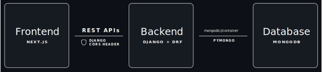

# WikiNetes 📚 + ☸️ = 🫶

WikiNetes is a free online article sharing platform service. 

<i>fig: WikiNetes Application Layout</i>

## Tech Stack 

- **Frontend** : Next.js

- **Backend** :
	+ Django + Django Rest Framework
	+ PyMongo

- **Database** : MongoDB

## Deployment (or Test Drive)

- Docker Compose
- Docker Swarm
- Kubernetes

---

### TO-DO

+ **Old Stuff**
	- Implement DB
	- DB interface function
	- MD to HTML
	- Build Editor
	- Build Basic Welcome Page
	- Build Nav

+ **Newer Stuff**
	- Implement Auth
	- Volumes & Persistence for DB
	- Config Files for Docker Compose
	- Config Files for Docker Swarm
	- Config Files for Kubernetes
	- Production Branch
	- GitHub Action Pipeline to make containers